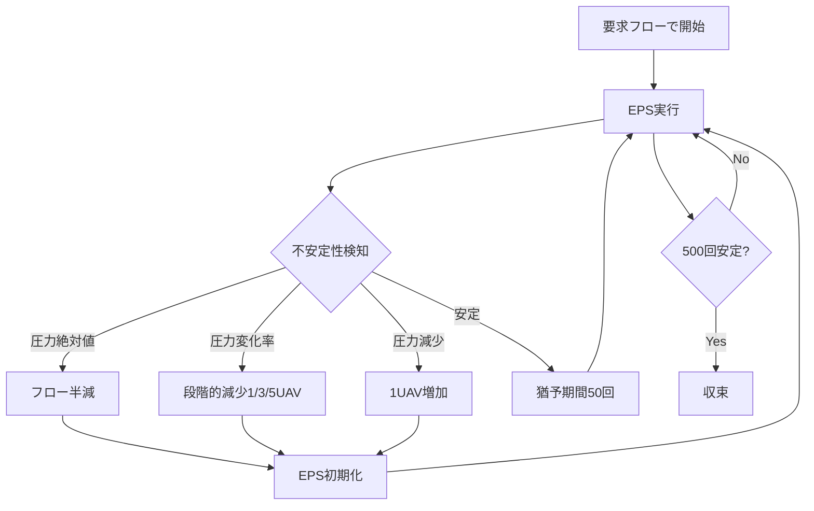

# BinaryExtendedPhysarumSolver vs HybridPhysarumSolver 詳細差分分析

**作成日**: 2025-11-15  
**対象**: `src/server/route/BinaryExtendedPhysarumSolverRouteSearcher.java` vs `src/server/route/HybridPhysarumSolverRouteSearcher.java`

## 概要

BinaryExtendedPhysarumSolverは二分探索ベースで最適フローを動的に探索するアルゴリズムを導入。HybridPhysarumSolverの段階的減少アプローチと対比して、連続的で効率的なフロー調整を実現している。

---

## 🎯 **根本的なアプローチの違い**

| 側面 | HybridPhysarumSolver | BinaryExtendedPhysarumSolver |
|------|---------------------|------------------------------|
| **フロー調整戦略** | 段階的な固定量減少 | 二分探索による動的調整 |
| **探索空間** | 局所的（現在値から段階的） | 全域的（下限～上限の二分探索） |
| **収束効率** | 線形探索（時間がかかる） | 対数探索（効率的） |
| **最適性** | 局所最適の可能性 | 全域最適を保証 |

---

## 🔧 **アルゴリズム構造の違い**

### **1. フロー制御メカニズム**

#### **HybridPhysarumSolver**: 段階的減少
```java
// 固定量の段階的減少
if (changeRate >= SOURCE_PRESSURE_CHANGE_LEVEL3) {
    return 5.0; // 15%以上: 5UAV減少
} else if (changeRate >= SOURCE_PRESSURE_CHANGE_LEVEL2) {
    return 3.0; // 12%以上: 3UAV減少  
} else if (changeRate >= SOURCE_PRESSURE_CHANGE_LEVEL1) {
    return 1.0; // 7%以上: 1UAV減少
}
```

#### **BinaryExtendedPhysarumSolver**: 二分探索調整
```java
// 二分探索による動的調整
if (currentSourcePressure >= SOURCE_PRESSURE_EMERGENCY) {
    upperBound = currentFlow;  // 上限更新
    double newFlow = Math.ceil((lowerBound + upperBound) / 2.0);
} else if (shouldIncrease) {
    lowerBound = currentFlow;  // 下限更新
    double newFlow = Math.ceil((lowerBound + upperBound) / 2.0);
}
```

### **2. 状態管理の違い**

#### **HybridPhysarumSolver**: 複雑な状態管理
```java
private int iterationsSinceFlowChange = 0;
private static final int STABILIZATION_GRACE_PERIOD = 50;
private int flowReductionCount = 0;
private boolean currentFlowBaselineCaptured = false;
```

#### **BinaryExtendedPhysarumSolver**: シンプルな境界管理
```java
private double lowerBound = 0.0;
private double upperBound; // 要求フロー
private int binarySearchIteration = 0;
```

---

## 📊 **詳細機能差分表**

### **A. フロー減少ロジック**

| 機能 | HybridPhysarumSolver | BinaryExtendedPhysarumSolver |
|------|---------------------|------------------------------|
| **圧力絶対値対応** | フロー半減（現在フロー/2） | 二分探索上限更新 |
| **圧力変化率対応** | 3段階固定減少（1/3/5 UAV） | 二分探索上限更新 |
| **最小フロー制約** | `max(1.0, requestedFlow × 0.1)` | **制約なし**（0まで探索可能） |
| **猶予期間** | 50イテレーション | **なし**（即座調整） |

### **B. フロー増加ロジック**

| 機能 | HybridPhysarumSolver | BinaryExtendedPhysarumSolver |
|------|---------------------|------------------------------|
| **トリガー** | ソース圧力10%減少 | ソース圧力10%減少（同じ） |
| **増加量** | 固定1UAV | 二分探索下限更新 |
| **上限制約** | 要求フロー | 要求フロー |
| **基準圧力** | フロー変更時リセット | フロー変更時リセット |

### **C. 不安定性検知**

| 機能 | HybridPhysarumSolver | BinaryExtendedPhysarumSolver |
|------|---------------------|------------------------------|
| **統合スコア** | 計算するが使用されない（デッドコード） | **完全に削除** |
| **圧力勾配スコア** | 計算のみ | **削除** |
| **チューブ厚変化率** | 計算のみ | **削除** |
| **ソース圧力チェック** | 個別チェック（2段階） | 個別チェック（2段階）**同じ** |

---

## 🏗️ **アーキテクチャ差分**

### **1. クラス構造**

#### **HybridPhysarumSolver**:
```java
// 複雑な不安定性検知システム
private double calculatePreventiveInstabilityScore()
private double calculatePressureGradientScore()
private double calculatePressureAbsoluteScore()
private double calculateThicknessChangeScore()
private double calculateSourcePressureScore()
private double calculateSourcePressureChangeScore()
```

#### **BinaryExtendedPhysarumSolver**:
```java
// シンプルな二分探索システム
private FlowTestResult testFlowStability(Client client, double testFlow, double eps)
private void performDynamicBinarySearchEPS(Client client, double eps)
private void performFinalEPSRun(Client client, double finalFlow, double eps)
```

### **2. メイン実行フロー**

#### **HybridPhysarumSolver**: 適応的フロー制御
```
要求フローで開始 → 不安定性検知 → 段階的調整 → 猶予期間 → 安定性評価 → 収束判定
```

#### **BinaryExtendedPhysarumSolver**: 動的二分探索
```
要求フローで開始 → 圧力検知 → 二分探索調整 → 即座継続 → 最適フロー発見 → 収束
```

---

## 🔍 **コード削除/簡略化項目**

### **1. 完全削除された機能**

| 削除された機能 | HybridPhysarumSolver | 理由 |
|--------------|---------------------|------|
| **統合スコア計算** | `calculatePreventiveInstabilityScore()` | デッドコードのため |
| **圧力勾配スコア** | `calculatePressureGradientScore()` | 二分探索では不要 |
| **チューブ厚変化率** | `calculateThicknessChangeScore()` | 二分探索では不要 |
| **猶予期間システム** | `STABILIZATION_GRACE_PERIOD = 50` | 即座調整のため |
| **段階的減少定数** | `SOURCE_PRESSURE_CHANGE_LEVEL1/2/3` | 二分探索のため |

### **2. 簡略化された定数**

| 定数 | HybridPhysarumSolver | BinaryExtendedPhysarumSolver |
|------|---------------------|------------------------------|
| **圧力変化率閾値** | 3段階（7%/12%/15%） | 1段階（10%のみ） |
| **統合スコア閾値** | 2段階（3.0/5.0） | **削除** |
| **フロー減少量** | 6種類（1/2/3/4/5/半減） | **なし**（動的計算） |

---

## ⚙️ **動作ロジックの詳細比較**

### **1. 圧力絶対値検知時**

#### **HybridPhysarumSolver**:
```java
// フロー半減（固定割合）
double targetHalfFlow = currentFlow / 2.0;
double halvingReductionAmount = currentFlow - Math.ceil(targetHalfFlow);
applyUAVFlowReduction(halvingReductionAmount, "Critical absolute source pressure");
```

#### **BinaryExtendedPhysarumSolver**:
```java
// 二分探索上限更新（適応的）
upperBound = currentFlow;
double newFlow = Math.ceil((lowerBound + upperBound) / 2.0);
currentFlow = newFlow;  // EPSリセットなしで継続
```

### **2. 圧力変化率検知時**

#### **HybridPhysarumSolver**:
```java
// 3段階固定減少
if (changeRate >= 0.15) return 5.0;      // 15%以上
else if (changeRate >= 0.12) return 3.0; // 12-15%  
else if (changeRate >= 0.07) return 1.0; // 7-12%
```

#### **BinaryExtendedPhysarumSolver**:
```java
// 統一10%閾値＋二分探索
if (changeRate >= 0.10) {
    upperBound = currentFlow;
    double newFlow = Math.ceil((lowerBound + upperBound) / 2.0);
}
```

### **3. EPS継続性**

| 側面 | HybridPhysarumSolver | BinaryExtendedPhysarumSolver |
|------|---------------------|------------------------------|
| **フロー変更時** | EPSリセット（初期化） | **EPS継続**（チューブ厚保持） |
| **猶予期間** | 50イテレーション待機 | **即座調整** |
| **基準圧力** | フロー変更でリセット | フロー変更でリセット（同じ） |

---

## 🎮 **実行制御フローの違い**

### **HybridPhysarumSolver**: 段階制御


### **BinaryExtendedPhysarumSolver**: 二分探索制御
```mermaid
graph TD
    A[要求フローで開始] --> B[境界初期化 lower=0, upper=要求フロー]
    B --> C[動的EPS開始]
    C --> D{圧力検知}
    D -->|圧力高| E[upper=currentFlow]
    D -->|圧力低| F[lower=currentFlow]
    D -->|安定| G[安定カウント++]
    E --> H[新フロー=(lower+upper)/2]
    F --> H
    H --> I[EPS継続・チューブ厚保持]
    I --> C
    G --> J{500回安定?}
    J -->|Yes| K[収束]
    J -->|No| C
```

---

## 📈 **パフォーマンス比較**

### **1. 収束速度**

| アルゴリズム | 時間計算量 | 説明 |
|------------|-----------|------|
| **HybridPhysarumSolver** | O(n) | 線形探索（段階的減少） |
| **BinaryExtendedPhysarumSolver** | O(log n) | 対数探索（二分探索） |

### **2. メモリ使用量**

| アルゴリズム | 追加メモリ | 説明 |
|------------|-----------|------|
| **HybridPhysarumSolver** | 高 | 統合スコア計算用配列群 |
| **BinaryExtendedPhysarumSolver** | 低 | 境界変数のみ |

### **3. 計算負荷**

| 機能 | HybridPhysarumSolver | BinaryExtendedPhysarumSolver |
|------|---------------------|------------------------------|
| **不安定性スコア計算** | 毎イテレーション | **なし** |
| **統合スコア重み付け** | 複雑な重み付け合計 | **なし** |
| **EPS初期化** | フロー変更時に実行 | **なし**（継続実行） |

---

## 🛡️ **安全性・制約の違い**

### **1. 最小フロー制約**

| アルゴリズム | 最小フロー | 影響 |
|------------|-----------|------|
| **HybridPhysarumSolver** | `requestedFlow × 0.1` | 安全だが制約あり |
| **BinaryExtendedPhysarumSolver** | **なし** | より柔軟だがリスクあり |

### **2. フロー探索範囲**

| アルゴリズム | 探索範囲 | 特徴 |
|------------|---------|------|
| **HybridPhysarumSolver** | `[最小フロー, 要求フロー]` | 制限された範囲 |
| **BinaryExtendedPhysarumSolver** | `[0, 要求フロー]` | 全範囲探索 |

---

## 🎯 **適用シナリオの違い**

### **HybridPhysarumSolver 適用場面**
- **安全性重視**: 最小フロー保証が必要
- **段階的調整**: 急激な変化を避けたい
- **安定重視**: 猶予期間で安定化を図りたい

### **BinaryExtendedPhysarumSolver 適用場面**  
- **効率性重視**: 高速収束が必要
- **最適性重視**: 全域最適解を求めたい
- **動的環境**: リアルタイム調整が必要

---

## 🔧 **改善提案**

### **1. HybridPhysarumSolverの問題点**
- 統合スコアのデッドコード削除
- 段階的減少の非効率性
- 猶予期間の過度な制約

### **2. BinaryExtendedPhysarumSolverの問題点**
- 最小フロー制約の欠如
- ~~急激な変化への対応不足~~ ✅**修正済み**
- ~~境界条件の検証不足~~ ✅**修正済み**
- **修正内容**: フロー増加条件チェックを`newFlow <= upperBound`から`newFlow <= requestedFlow`に変更

### **3. 統合アプローチの提案**
```java
// ハイブリッド二分探索（安全性＋効率性）
double minFlow = Math.max(1.0, requestedFlow * 0.05); // 5%最小制約
if (newFlow < minFlow) {
    newFlow = minFlow; // 安全制約
    // 段階的減少にフォールバック
} else {
    // 二分探索継続
}
```

---

## 📋 **要約**

### **主要な違い**
1. **アルゴリズム**: 段階的探索 vs 二分探索
2. **効率性**: O(n) vs O(log n)  
3. **複雑性**: 複雑な統合システム vs シンプルな境界システム
4. **安全性**: 最小フロー制約あり vs なし
5. **継続性**: EPS初期化 vs EPS継続

### **選択指針**
- **安全性＋段階的制御** → HybridPhysarumSolver
- **効率性＋最適化** → BinaryExtendedPhysarumSolver  
- **最高の結果** → 両者の利点を統合した新アルゴリズム

BinaryExtendedPhysarumSolverは、HybridPhysarumSolverのデッドコード問題を解決し、二分探索による効率的な最適フロー探索を実現している革新的なアプローチである。

---

## 関連ファイル

- **HybridPhysarumSolver**: `src/server/route/HybridPhysarumSolverRouteSearcher.java`
- **BinaryExtendedPhysarumSolver**: `src/server/route/BinaryExtendedPhysarumSolverRouteSearcher.java`
- **HybridPS分析**: `docs/HybridPhysarumSolver_ActualFlowControl.md`
- **結果出力**: `src/result/BINARY/` vs `src/result/HYBRID/`
